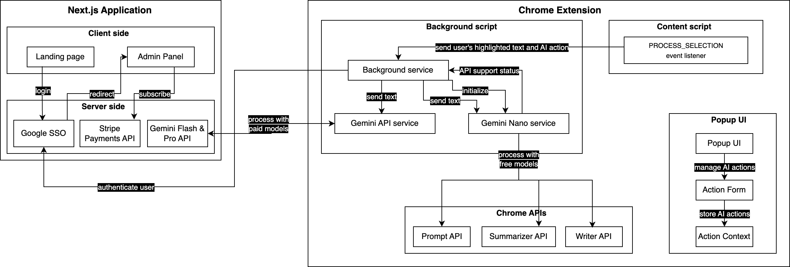
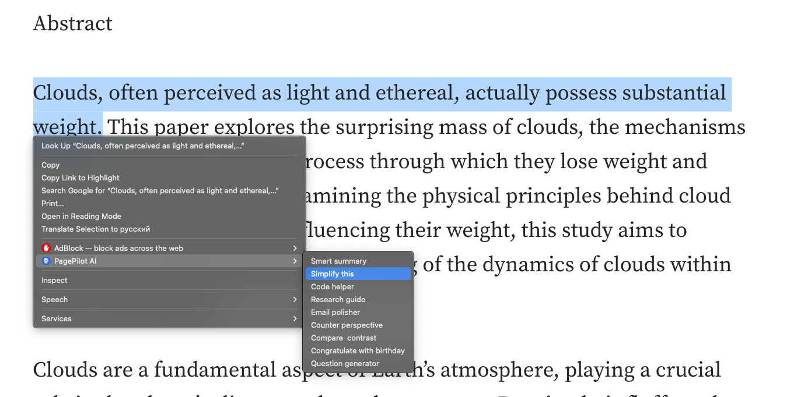
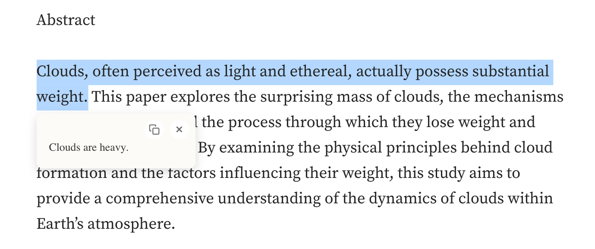

# PagePilot AI: Chrome's Smart Assistant 🚀

> Use AI in-place when reading content on web pages. No more tab switching, no more copy-pasting – access AI capabilities right where you're reading.

# Architecture



## Get started

1. Download an extension from Chrome Extension's web store (LINK)
2. Login into the admin panel (LINK)

## Examples


<p>|</p>


## Project Structure

```
/
├── manifest.json            # Chrome extension manifest
├── popup.html              # Extension popup HTML
├── src/
│   ├── popup.tsx          # Popup entry point
│   ├── background.ts      # Background script
│   ├── contentScript.ts   # Content script
│   ├── components/        # React components
│   ├── context/           # React context
│   ├── services/          # Service layer
│   ├── types/            # TypeScript types
│   └── utils/            # Utility functions
├── vite.config.ts         # Vite configuration
└── package.json
```

## Technologies Used

- Chrome Extension APIs
- Google Gemini API
- Google Nano (Prompt API, Summarization API, Write API)
- Frontend and Backend: Next.js, React, TypeScript, Vite
- Styling: Material UI, Tailwind CSS

## Future Improvements

- [ ] Implement an AI actions gallery for sharing custom templates
- [ ] Launch smart subscription pricing - pay only for what you use
- [ ] Add AI action categories
- [ ] Add cross-platform browser support (Microsoft Edge, Mozilla, Safari)
- [ ] Add support for more AI models
- [ ] Add custom styling options
- [ ] Support for multiple languages

## Contributors & Contact Details

👤 **Akezhan Rakishev**

- LinkedIn: [Akezhan Rakishev](https://www.linkedin.com/in/akezhan-rakishev-841505170/)
- Email: rakishev.akezhan@gmail.com
- Phone: +1 (628) 529-5586
